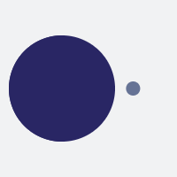

<a name="readme-top"></a>

<br />
<div align="center">
  <a href="#">
    
  </a>

<h3 align="center">Admin Dashboard</h3>

  <p align="center">
    Looks stunning on every screen size and is optimized to bring the large-screen experience from desktop to mobile.
    <br />
    <a href="https://github.com/ChristopherAlphonse/admindashboard"><strong>Explore the docs »</strong></a>
    <br />
    <br />
  
  </p>
</div>

<!-- TABLE OF CONTENTS -->
<details>
  <summary>Table of Contents</summary>
  <ol>
    <li>
      <a href="#about-the-project">About This Project</a>
      <ul>
        <li><a href="#built-with">Built With</a></li>
      </ul>
    </li>
    <li>
      <a href="#getting-started">Getting Started</a>
      <ul>
        <li><a href="#prerequisites">Prerequisites</a></li>
        <li><a href="#installation">Installation</a></li>
      </ul>
    </li>
    <li><a href="#usage">Usage</a></li>

  </ol>
</details>

<!-- ABOUT THE PROJECT -->

## About The Project

![Product Screen Shot][product-screenshot]

### Built With

- ![React][react] ![Node][node] ![Mongo][mongo]

<p align="right">(<a href="#readme-top">back to top</a>)</p>

<!-- GETTING STARTED -->

## Getting Started

This is an example of how you may give instructions on setting up your project locally.
To get a local copy up and running follow these simple example steps.

### Prerequisites

Open your terminal and sure node and nodemon is installed and up to date

- Make a folder
  ```sh
  mkdir admindashboard
  cd admindashboard
  ```

### Installation

1. Clone the repo
   ```sh
   git clone https://github.com/ChristopherAlphonse/admindashboard.git
   code .
   ```
2. Install packages
   ```sh
   yarn or npm i
   ```
3. Enter your ENV in both client and sever folder
   ```
   yarn add dotenv or npm i dotenv
   ```

<p align="right">(<a href="#readme-top">back to top</a>)</p>

<!-- USAGE EXAMPLES -->

## Usage

Usage of this repo or software will help provide a greater understand for error handling, password resetting, and creating and deleting users from a database.

<!-- _For more examples, please refer to the [Documentation](https://example.com)_ -->

<p align="right">(<a href="#readme-top">back to top</a>)</p>

[react]: ./example/icons/react_icon.png
[node]: ./example/icons/node_icon.png
[mongo]: ./example/icons/mongo_icon.png
[redux]: ./example/icons/redux.png
[sass]: ./example/icons/sass.png
[product-screenshot]: ./Client/src/assets/logo.png
